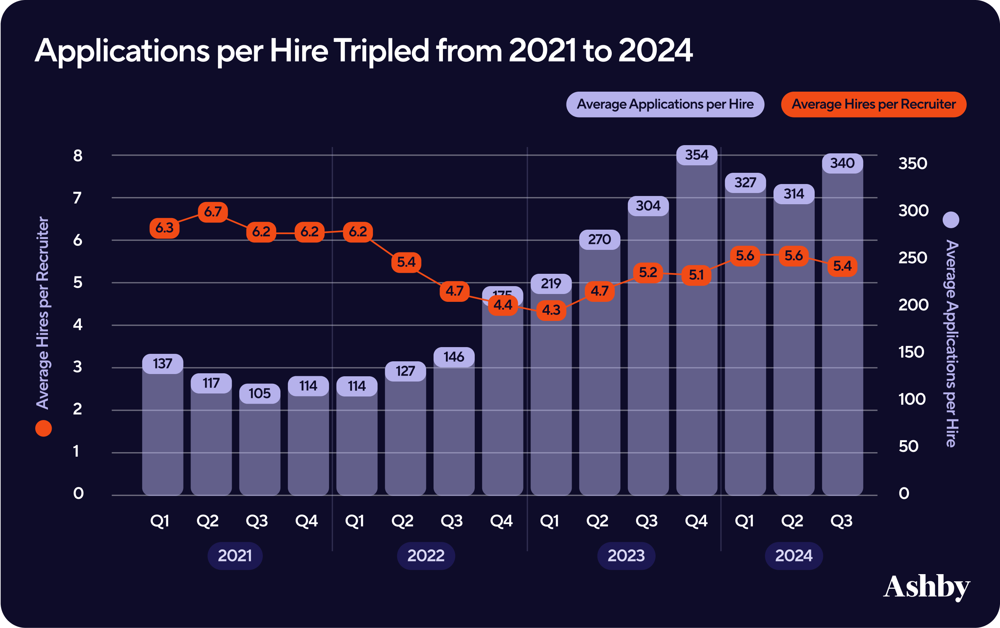
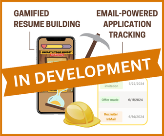
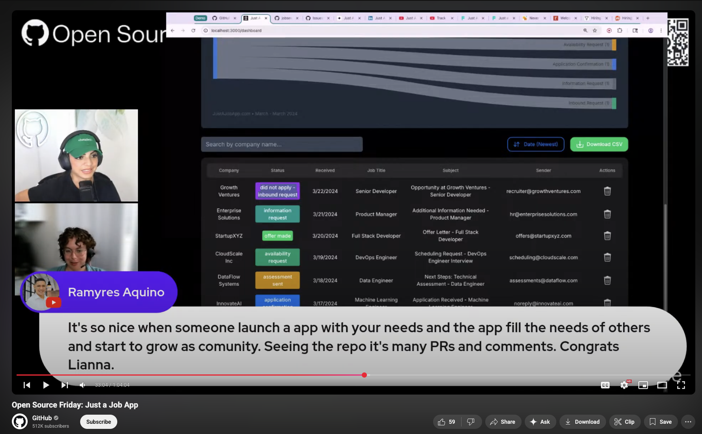

# Just A Job App

## 9 out of 10 applications are met with rejection or silence.
## We're building the platform to make yours the one they can't ignore.

The job search is officially broken, and it's not just you. Applications per hire have tripled since early 2021, leaving even qualified candidates stuck in an endless cycle of submitting resumes into the void.

## Get Started

Choose your DIY Install path: 
- Like watching? [Video 📹](https://github.com/just-a-job-app/jobseeker-analytics?tab=contributing-ov-file#-video-tutorial-diy-install) 
- More of a reader? [Manual 📖](https://github.com/just-a-job-app/jobseeker-analytics?tab=contributing-ov-file#-written-tutorial-diy-install)

No GitHub account? [Join the waitlist](https://app.formbricks.com/s/cmf667qha4ahcyg01nu13lsgo?source=GHREAD1).

## Problem: The Job Search is Officially Broken

Does this sound familiar? You spend hours tailoring your resume and writing the perfect cover letter, only to send it into a black hole. Days turn into weeks. The only reply is a generic rejection email, or worse, complete silence.

You're not imagining it. The game has changed:
- **It's 3x more competitive:** The number of applications per hire has tripled since early 2021.
- **It's overwhelming:** Our research shows 77% of job seekers use over three different tools to manage a process 64% already find frustrating.
- **It's leading to burnout:** 64% of applicants report feeling exhausted and stuck.

## Our Solution: A Smarter Way to Job Search

Imagine a single platform that not only organizes your entire job search but also helps you perfect your resume with real, anonymous feedback *before* you apply.

We are creating a seamless experience that integrates our email-powered application tracker with **Shining Nuggets**, a mobile game designed to discover and validate your most impressive accomplishments:

1. ✅ **You'll Get Organized Instantly**  
   See your entire job search pipeline in one clean dashboard, with email-powered features that automate the tedious parts.

2. 🔬 **You'll Play 'Shining Nuggets'**  
   Mine your professional achievements and get them anonymously peer-reviewed in fun, 6-second challenges.

3. 🔬 **You'll Apply with Data-Backed Confidence**  
   Use your top-rated, validated achievements to build resumes that get noticed, closing the frustrating gap between application and interview.

Key:
✅ = Feature Deployed
🔬 = User Research Phase

## Launch & Beta

Interested in trying out the new features? Join the waitlist [here](https://app.formbricks.com/s/cmf667qha4ahcyg01nu13lsgo?source=GHREAD2).

## News 

In July 2025, we secured a feature on GitHub's official YouTube channel, which has over 500,000 subscribers.

🎥 [Watch the full episode here](https://youtu.be/sbzKMVaYHZw?list=PL0ZEIUccq0tD_c7gV0lAMXDXl-xK4pxch&t=1260) 

## Get Involved

- Contribute: see [CONTRIBUTING.md](https://github.com/just-a-job-app/jobseeker-analytics?tab=contributing-ov-file#welcome-to-do-it-yourself-diy-install)  
- Community: https://discord.gg/gsdpMchCam  
- Support: help@justajobapp.com

## Join the Miner's Union

